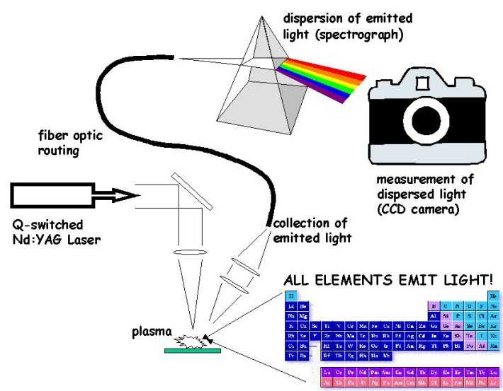
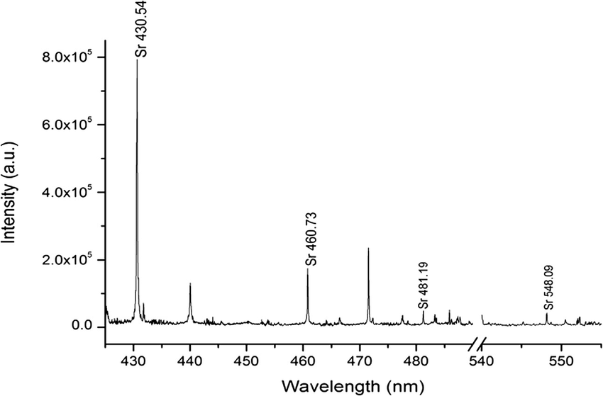

```{r libraries, echo=FALSE}
library(png)
library(jpeg)
library(knitr)
```

# Introduction

As part of my postgraduate studies I had the opportunity of working with many experimental data, but mostly spectral data from Laser-induced breakdown spectroscopy (LIBS). LIBS is a type of atomic emission spectroscopy which uses a highly energetic laser pulse as the excitation source. The laser is focused to form a plasma, which atomizes and excites samples. The formation of the plasma only begins when the focused laser achieves a certain threshold for optical breakdown, which generally depends on the environment and the target material.

```{r img1, echo=FALSE, fig.align='center'}
#img1 <- readPNG("./libs setup.png", native = T, info = TRUE)
#attr(img1, "info")

```

LIBS operates by focusing the laser onto a small area at the surface of the specimen; when the laser is discharged it ablates a very small amount of material, in the range of nanograms to picograms, which generates a plasma plume with temperatures in excess of 100 000 K. At the high temperatures during the early plasma, the ablated material dissociates (breaks down) into excited ionic and atomic species. During this time, the plasma emits a continuum of radiation which does not contain any useful information about the species present, but within a very small timeframe the plasma expands at supersonic velocities and cools. At this point the characteristic atomic emission lines of the elements can be observed.

Because all elements emit light of characteristic frequencies when excited to sufficiently high temperatures, LIBS can (in principle) detect all elements, limited only by the power of the laser as well as the sensitivity and wavelength range of the spectrograph & detector.

```{r img2, echo=FALSE, fig.align='center'}
#img2 <- readPNG("./libs spectra.ppm", native = T, info = TRUE)
#attr(img1, "info")

```
As part of Euro-Mediterranean Symposium on Laser-Induced Breakdown Spectroscopy 2019, the EMSLIBS classification contest was released. I couldn't participated of this contest, I was starting my master degree, but I think it's an perfect opportunity to test my Data Analysis and Machine Learning skills in a field that is known for me - Physics and materials science. 